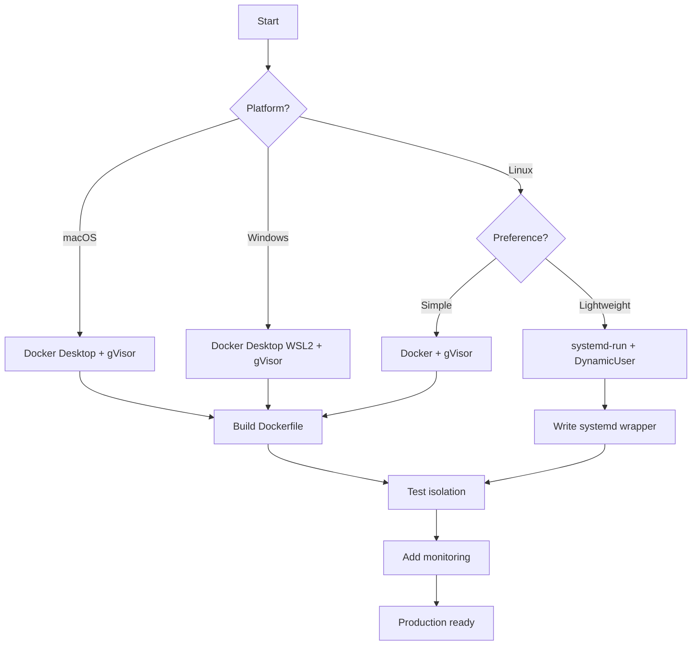

# Sandbox Options for Claude Code Under `--dangerously-skip-permissions`

**Date:** 2025-10-27
**Purpose:** Evaluate sandbox technologies for running Claude Code autonomously with safety guarantees

## Executive Summary

After researching available sandboxing technologies, I've identified **5 viable approaches** ranging from lightweight namespace isolation to full containerization. Each approach offers different trade-offs between security, observability, and ease of implementation.

**Platform Context:**

- **Primary**: macOS (your development environment)
- **Secondary**: Windows (for other users)
- **Implication**: Most Linux-native solutions require virtualization layer

**Recommended Path:** Use **Docker Desktop** (works on macOS/Windows/Linux) with **gVisor runtime** for consistent cross-platform sandboxing. This is the ONLY solution that works natively across all three platforms.

---

## Requirements Analysis

### Cohesive

- All sandbox features must work together seamlessly
- Minimal configuration complexity
- Clear mental model for developers

### Observable

- Ability to inspect sandbox state in real-time
- Comprehensive logging of all activities
- Easy debugging when things go wrong

### Secure

- Filesystem isolation (read-only host, writable workspace)
- Network isolation or controlled egress
- Resource limits (CPU, memory, disk I/O)
- System call filtering
- Process isolation

---

## Option 1: Docker + gVisor Runtime

### Overview

Use Docker containers with gVisor's `runsc` runtime for enhanced kernel isolation. This provides VM-level security with container-level performance.

### Architecture

```
Claude Code (host) → Docker API → runsc (gVisor) → Sandboxed Process
```

### Security Features

- **Kernel Isolation**: gVisor intercepts all syscalls, limiting kernel surface exposure
- **Filesystem**: Bind mounts with read-only/read-write controls
- **Network**: Isolated network namespace, optional egress filtering
- **Resources**: Docker's native CPU/memory limits via cgroups
- **Mature**: Used in production at Google for untrusted workloads

### Observability

✅ **Excellent**

- `docker logs` for real-time output
- `docker inspect` for container state
- `docker stats` for resource usage
- `docker exec` for interactive debugging
- Volume mounts for file inspection

### Cohesiveness

✅ **Good**

- Well-documented Docker API
- Integrates with existing container ecosystem
- Clear separation: host vs. container

### Implementation Complexity

⚠️ **Medium**

- Requires Docker installation
- gVisor setup adds complexity
- Image management overhead
- Cross-platform considerations (Docker Desktop on macOS)

### Performance

✅ **Good**

- Near-native performance
- gVisor adds ~10-15% overhead vs. runc
- Much faster than full VMs

### Trade-offs

- ✅ Industry-standard, well-tested
- ✅ Strong isolation guarantees
- ✅ Rich ecosystem (Docker Compose, monitoring tools)
- ⚠️ Heavier weight than namespace-only solutions
- ⚠️ Requires Docker daemon
- ❌ More complex for simple use cases

### Best For

- Production deployments
- Multi-tenant scenarios
- When strong security is paramount
- Cross-platform compatibility needed

---

## Option 2: systemd-run + DynamicUser

### Overview

Use systemd's built-in sandboxing features with temporary dynamic users. No external dependencies, available on all modern Linux systems.

### Architecture

```
Claude Code → systemd-run → Temporary Unit → Sandboxed Process (dynamic UID)
```

### Security Features

- **Dynamic Users**: Temporary UID created/destroyed automatically
- **Filesystem**: `ProtectSystem=strict`, `PrivateTmp=yes`, `ReadOnlyPaths=`
- **Network**: `PrivateNetwork=yes` for isolation
- **Resources**: `MemoryMax=`, `CPUQuota=`, `TasksMax=`
- **Syscall Filtering**: `SystemCallFilter=` with allowlists
- **Namespaces**: `PrivateDevices=yes`, `ProtectKernelModules=yes`

### Observability

✅ **Excellent**

- `journalctl` integration for logging
- `systemctl status` for runtime state
- `systemd-cgls` for cgroup hierarchy
- `systemd-cgtop` for resource monitoring

### Cohesiveness

✅ **Excellent**

- Native Linux tooling, no external deps
- Single `systemd-run` command
- Well-integrated with system logging

### Implementation Complexity

✅ **Low**

- No installation required (systemd is standard)
- Simple command-line interface
- Easy to script

### Performance

✅ **Excellent**

- Minimal overhead
- Native Linux namespaces
- No daemon required

### Trade-offs

- ✅ Zero installation overhead
- ✅ Native integration with Linux
- ✅ Lightweight and fast
- ✅ Perfect for quick prototyping
- ⚠️ Linux-only (no macOS/Windows)
- ⚠️ Less isolation than gVisor
- ⚠️ Fewer ecosystem tools

### Example Usage

```bash
systemd-run \
  --user \
  --scope \
  --property=DynamicUser=yes \
  --property=PrivateNetwork=yes \
  --property=ProtectSystem=strict \
  --property=PrivateTmp=yes \
  --property=MemoryMax=2G \
  --property=CPUQuota=200% \
  --setenv=HOME=/tmp \
  -- /path/to/claude-code-wrapper
```

### Best For

- Quick prototyping and development
- Linux-only deployments
- Minimal overhead requirements
- Learning and experimentation

---

## Option 3: Bubblewrap

### Overview

Lightweight, unprivileged sandboxing tool used by Flatpak. Minimal wrapper around Linux namespaces.

### Architecture

```
Claude Code → bubblewrap (bwrap) → Sandboxed Process
```

### Security Features

- **Namespaces**: Mount, PID, IPC, UTS, User namespaces
- **Filesystem**: Fine-grained bind mount control
- **Seccomp**: Syscall filtering
- **No Setuid**: Uses user namespaces (unprivileged)

### Observability

⚠️ **Moderate**

- Stdout/stderr capture
- Process tree visible from host
- Limited built-in monitoring
- Requires external tooling for deep inspection

### Cohesiveness

✅ **Good**

- Simple command-line tool
- Minimal conceptual overhead
- Used by Flatpak (proven in production)

### Implementation Complexity

✅ **Low**

- Easy to install (`apt install bubblewrap`)
- Simple invocation
- Good documentation

### Performance

✅ **Excellent**

- Minimal overhead
- Direct namespace usage

### Trade-offs

- ✅ Unprivileged (no root required)
- ✅ Lightweight
- ✅ Good for desktop apps
- ⚠️ Linux-only
- ⚠️ Less comprehensive than systemd sandboxing
- ⚠️ Manual resource limit setup

### Best For

- Unprivileged environments
- Desktop application sandboxing
- When you need finer control than Firejail

---

## Option 4: Google nsjail

### Overview

Process isolation tool from Google combining namespaces, cgroups, rlimits, and seccomp-bpf.

### Architecture

```
Claude Code → nsjail → Sandboxed Process
```

### Security Features

- **Comprehensive**: All Linux namespaces supported
- **Resource Limits**: CPU time, memory, wall time
- **Seccomp-BPF**: Kafel language for syscall policies
- **Capabilities**: Fine-grained capability dropping
- **Mount Control**: chroot, pivot_root, RO remounting

### Observability

✅ **Good**

- Detailed logging
- Resource usage reporting
- Clean stdout/stderr handling
- Config files for complex setups

### Cohesiveness

✅ **Good**

- Single binary
- Config file support for complex scenarios
- Designed for security challenges (CTFs)

### Implementation Complexity

⚠️ **Medium**

- Requires compilation from source (typically)
- More complex configuration for advanced features
- Steeper learning curve

### Performance

✅ **Excellent**

- Very low overhead
- Production-tested at Google

### Trade-offs

- ✅ Battle-tested (Google production)
- ✅ Very comprehensive security features
- ✅ Great for CTF-style isolation
- ⚠️ Requires building from source
- ⚠️ Linux-only
- ⚠️ Less mainstream than Docker

### Best For

- Maximum security isolation
- CTF/security challenge hosting
- When you need programmatic seccomp policies

---

## Option 5: Firejail

### Overview

User-friendly SUID sandbox with pre-built profiles for common applications.

### Architecture

```
Claude Code → firejail → Sandboxed Process
```

### Security Features

- **Namespaces**: All major Linux namespaces
- **Seccomp-BPF**: Syscall filtering
- **Profiles**: 1000+ pre-built application profiles
- **Capabilities**: Automatic capability dropping

### Observability

⚠️ **Moderate**

- Basic logging
- `firejail --list` shows running sandboxes
- `firejail --tree` shows process hierarchy
- Limited real-time monitoring

### Cohesiveness

✅ **Excellent**

- Dead simple: `firejail <command>`
- Pre-built profiles reduce configuration
- Great for desktop users

### Implementation Complexity

✅ **Very Low**

- Single package install
- Minimal configuration needed
- Best beginner experience

### Performance

✅ **Excellent**

- Very low overhead

### Trade-offs

- ✅ Easiest to use
- ✅ Great for desktop apps
- ✅ Large profile library
- ⚠️ SUID binary (security considerations)
- ⚠️ Less fine-grained control
- ⚠️ CVE history (TIOCSTI escapes)

### Best For

- Quick testing
- Desktop application isolation
- When ease-of-use is priority #1

---

## Comparison Matrix

| Feature | Docker+gVisor | systemd-run | Bubblewrap | nsjail | Firejail |
|---------|--------------|-------------|------------|--------|----------|
| **Security** | ⭐⭐⭐⭐⭐ | ⭐⭐⭐⭐ | ⭐⭐⭐⭐ | ⭐⭐⭐⭐⭐ | ⭐⭐⭐ |
| **Observability** | ⭐⭐⭐⭐⭐ | ⭐⭐⭐⭐⭐ | ⭐⭐⭐ | ⭐⭐⭐⭐ | ⭐⭐⭐ |
| **Cohesiveness** | ⭐⭐⭐⭐ | ⭐⭐⭐⭐⭐ | ⭐⭐⭐⭐ | ⭐⭐⭐⭐ | ⭐⭐⭐⭐⭐ |
| **Ease of Setup** | ⭐⭐⭐ | ⭐⭐⭐⭐⭐ | ⭐⭐⭐⭐ | ⭐⭐⭐ | ⭐⭐⭐⭐⭐ |
| **Performance** | ⭐⭐⭐⭐ | ⭐⭐⭐⭐⭐ | ⭐⭐⭐⭐⭐ | ⭐⭐⭐⭐⭐ | ⭐⭐⭐⭐⭐ |
| **macOS Support** | ✅ | ❌ | ❌ | ❌ | ❌ |
| **Windows Support** | ✅ | ❌ | ❌ | ❌ | ❌ |
| **Linux Support** | ✅ | ✅ | ✅ | ✅ | ✅ |
| **Production Ready** | ✅ | ✅ | ✅ | ✅ | ⚠️ |
| **No Root Required** | ⚠️ | ⚠️ | ✅ | ❌ | ❌ |

**🔴 CRITICAL FOR YOUR USE CASE:** Only Docker+gVisor works on macOS and Windows. All other options require Linux.

---

## Recommendations for macOS/Windows/Linux

### 🎯 PRIMARY RECOMMENDATION: Docker Desktop + gVisor

**This is the ONLY cross-platform solution.**

#### Why This is Your Best Choice

1. **Works on macOS (your primary platform)**: Docker Desktop runs a lightweight Linux VM transparently
2. **Works on Windows**: Same Docker Desktop approach with WSL2 backend
3. **Works on Linux**: Native Docker with optional gVisor runtime
4. **Consistent experience**: Same commands, same Dockerfile across all platforms
5. **Strong isolation**: gVisor provides VM-level security with container performance
6. **Excellent observability**: Docker's tooling is mature and comprehensive

#### macOS-Specific Considerations

Docker Desktop for Mac uses a **LinuxKit VM** under the hood:

- Runs in a lightweight Hypervisor.framework VM
- Filesystem sharing via VirtioFS (fast)
- Network forwarding works transparently
- Resource limits enforced by VM boundaries

**Performance:** Acceptable overhead (~10-20% vs native) due to VM layer + gVisor

#### Installation Steps for macOS

```bash
# 1. Install Docker Desktop
# Download from: https://www.docker.com/products/docker-desktop

# 2. Install gVisor runtime (runsc)
# Two options:

# Option A: Manual installation
wget https://storage.googleapis.com/gvisor/releases/release/latest/x86_64/runsc
wget https://storage.googleapis.com/gvisor/releases/release/latest/x86_64/runsc.sha512
sha512sum -c runsc.sha512
chmod +x runsc
sudo mv runsc /usr/local/bin

# Option B: Using Homebrew (easier)
brew install gvisor

# 3. Configure Docker to use runsc
# Add to ~/.docker/daemon.json (create if doesn't exist)
{
  "runtimes": {
    "runsc": {
      "path": "/usr/local/bin/runsc"
    }
  }
}

# 4. Restart Docker Desktop
```

#### Sample Implementation

**Dockerfile:**

```dockerfile
# Dockerfile.claude-sandbox
FROM python:3.11-slim

# Install system dependencies
RUN apt-get update && apt-get install -y \
    git \
    && rm -rf /var/lib/apt/lists/*

# Install Claude Code
# (Adjust this based on actual installation method)
RUN pip install --no-cache-dir anthropic-claude-code

# Create workspace with appropriate permissions
RUN mkdir -p /workspace /tmp/claude-tmp && \
    chmod 1777 /workspace /tmp/claude-tmp

# Create non-root user
RUN useradd -m -u 1000 claudeuser

WORKDIR /workspace
USER claudeuser

# Environment variables
ENV CLAUDE_WORKSPACE=/workspace
ENV TMPDIR=/tmp/claude-tmp
ENV HOME=/tmp/claude-tmp

ENTRYPOINT ["claude", "code", "--dangerously-skip-permissions"]
CMD []
```

**Build and Run Script:**

```bash
#!/bin/bash
# run-sandbox.sh - Works on macOS, Windows (Git Bash), Linux

set -euo pipefail

WORKSPACE_DIR="${1:-.}"
PROJECT_NAME="${2:-claude-project}"

# Build the sandbox image
docker build -t claude-sandbox:latest -f Dockerfile.claude-sandbox .

# Run with gVisor and strict limits
docker run \
  --rm \
  --runtime=runsc \
  --name "claude-sandbox-${PROJECT_NAME}" \
  --memory=4g \
  --cpus=4 \
  --pids-limit=512 \
  --network=none \
  --read-only \
  --tmpfs /tmp/claude-tmp:rw,noexec,nosuid,size=1g \
  -v "$(realpath "${WORKSPACE_DIR}"):/workspace:rw" \
  -e "ANTHROPIC_API_KEY=${ANTHROPIC_API_KEY}" \
  claude-sandbox:latest "$@"
```

**Usage:**

```bash
# Set your API key
export ANTHROPIC_API_KEY="your-key-here"

# Run the sandbox
./run-sandbox.sh ./my-project "my-task"
```

### Alternative: Linux VM on macOS (Advanced Users)

If you want to use Linux-native tools (systemd-run, nsjail, etc.) on macOS:

**Option 1: Lima (Lightweight VM)**

```bash
# Install Lima
brew install lima

# Start Ubuntu VM
limactl start --name=claude-sandbox template://ubuntu

# SSH into VM
lima claude-sandbox

# Now you can use systemd-run, nsjail, etc.
```

**Option 2: Multipass (Canonical)**

```bash
# Install Multipass
brew install multipass

# Launch Ubuntu VM
multipass launch --name claude-sandbox --cpus 4 --memory 4G --disk 20G

# Shell into VM
multipass shell claude-sandbox
```

**Option 3: UTM (Apple Silicon native)**

- Full VM solution for M1/M2 Macs
- Better performance than VirtualBox on Apple Silicon
- GUI-based VM management

### ⚠️ What Doesn't Work on macOS

These Linux-native tools **DO NOT** work on macOS:

- ❌ systemd-run (no systemd on macOS)
- ❌ Firejail (Linux namespaces not available)
- ❌ Bubblewrap (Linux-specific)
- ❌ nsjail (Linux-specific)

### Windows Support Strategy

For Windows users:

1. **Docker Desktop with WSL2** (Recommended)
   - Install Docker Desktop for Windows
   - Enables WSL2 backend automatically
   - Same Dockerfile and commands work
   - Better performance than Hyper-V backend

2. **WSL2 + Native Linux Tools** (Advanced)
   - Install Ubuntu in WSL2
   - Use systemd-run, nsjail, etc. natively
   - More complex setup, better performance

### Recommended Development Path



### Phase 1: Proof of Concept (Week 1)

**Goal:** Get a working sandbox on macOS

1. Install Docker Desktop on your Mac
2. Install gVisor runtime
3. Create basic Dockerfile
4. Test with simple Claude Code task
5. Verify isolation works
   - Can't read `/etc/passwd` on host
   - Can't make network connections
   - Resource limits enforced

### Phase 2: Observability (Week 2)

**Goal:** Make the sandbox inspectable

1. Add structured logging
2. Create monitoring dashboard
3. Implement real-time status viewer
4. Add filesystem snapshot capability

### Phase 3: Cross-Platform Testing (Week 3)

**Goal:** Ensure Windows users can use it

1. Test on Windows 11 with Docker Desktop
2. Document Windows-specific setup
3. Create installation scripts
4. Handle platform-specific edge cases

### Phase 4: Production Hardening (Week 4)

**Goal:** Make it secure and robust

1. Adversarial testing (try to escape)
2. Performance optimization
3. Error handling and recovery
4. Documentation and runbooks

---

## Alternative: Python Subprocess Approach

### For Minimal Overhead

If you want to avoid external dependencies entirely, you could build a pure Python solution:

```python
import subprocess
import resource
import os

def sandbox_claude(cmd, workspace_dir):
    def set_limits():
        # Limit to 4GB memory
        resource.setrlimit(resource.RLIMIT_AS, (4 * 1024**3, 4 * 1024**3))
        # Limit to 5 minutes CPU time
        resource.setrlimit(resource.RLIMIT_CPU, (300, 300))
        # Drop to nobody user
        os.setgid(65534)
        os.setuid(65534)

    proc = subprocess.Popen(
        cmd,
        cwd=workspace_dir,
        preexec_fn=set_limits,
        stdout=subprocess.PIPE,
        stderr=subprocess.PIPE
    )
    return proc
```

**⚠️ WARNING:** This provides minimal security. Resource limits can be bypassed, and filesystem access is not restricted. **NOT RECOMMENDED** except for initial experimentation.

---

## Implementation Roadmap

### Week 1: Proof of Concept

- [ ] Set up systemd-run wrapper script
- [ ] Test with simple Claude Code task
- [ ] Implement basic logging and monitoring
- [ ] Document escape attempts and failures

### Week 2: Hardening

- [ ] Add seccomp filtering
- [ ] Implement filesystem restrictions
- [ ] Test resource limit enforcement
- [ ] Create observability dashboard

### Week 3: Docker Migration

- [ ] Build Docker image with Claude Code
- [ ] Install and configure gVisor
- [ ] Migrate systemd-run config to Dockerfile
- [ ] Test cross-platform compatibility

### Week 4: Production Testing

- [ ] Run adversarial escape tests
- [ ] Measure performance overhead
- [ ] Document operational procedures
- [ ] Create runbooks for common scenarios

---

## Security Considerations

### Must Have

1. **Read-only root filesystem** (except workspace)
2. **No network access** (or strict egress filtering)
3. **CPU/memory limits** to prevent DoS
4. **Seccomp filtering** to block dangerous syscalls
5. **Process isolation** (separate PID namespace)

### Nice to Have

1. **Audit logging** of all system calls
2. **Filesystem snapshots** for rollback
3. **Time limits** on execution
4. **Disk I/O throttling**

### Testing Strategy

Run Claude Code in sandbox and attempt to:

- [ ] Read files outside workspace (`/etc/passwd`)
- [ ] Write files outside workspace (`/tmp/escape`)
- [ ] Make network connections
- [ ] Fork bomb (exceed resource limits)
- [ ] Execute privileged operations
- [ ] Escape via known CVEs

---

## Conclusion

### For Your macOS + Windows Use Case

**There is only ONE viable option: Docker Desktop + gVisor**

All other solutions (systemd-run, Firejail, Bubblewrap, nsjail) are Linux-only and would require running a full Linux VM on macOS/Windows, which defeats the purpose of a lightweight sandbox.

### Decision Matrix

| Your Requirement | Docker Desktop + gVisor | Linux VM + systemd-run |
|------------------|-------------------------|------------------------|
| **Works on macOS** | ✅ Yes (via Docker Desktop) | ⚠️ Requires VM layer |
| **Works on Windows** | ✅ Yes (via WSL2) | ⚠️ Requires WSL2 or VM |
| **Cohesive** | ✅ Single tool, consistent API | ❌ VM + systemd complexity |
| **Observable** | ✅ Docker logs, inspect, stats | ✅ journalctl (inside VM) |
| **Secure** | ✅ gVisor kernel isolation | ✅ Strong (but VM overhead) |
| **Easy Setup** | ✅ Docker Desktop installer | ❌ Manual VM configuration |
| **Performance** | ✅ Good (10-20% overhead) | ⚠️ Higher VM overhead |

### Recommended Implementation Path

1. **Week 1**: Install Docker Desktop + gVisor on your Mac
2. **Week 2**: Build initial Dockerfile and test basic sandboxing
3. **Week 3**: Add observability (logging, monitoring, dashboards)
4. **Week 4**: Test on Windows, document, create installer scripts

### Three Requirements Met

- ✅ **Cohesive**: Docker provides unified API, consistent across platforms
- ✅ **Observable**: `docker logs`, `docker inspect`, `docker stats`, volume mounts for file inspection
- ✅ **Secure**: gVisor intercepts all syscalls, filesystem isolation, network isolation, resource limits

### Next Steps

1. Review this analysis
2. Confirm Docker Desktop + gVisor approach
3. I can help you build the initial Dockerfile and wrapper scripts
4. Set up testing harness to validate sandbox security
